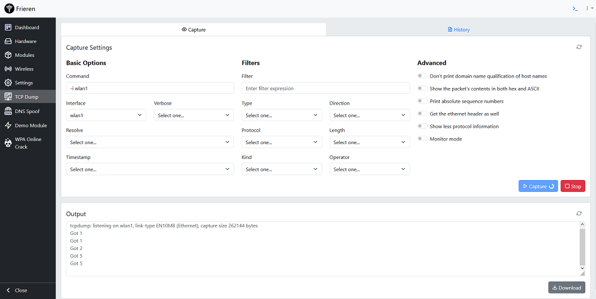

# Frieren: The micro-framework for security gadgets



## Description

Frieren is an advanced micro-framework and application stack designed for routers and Single Board Computers (SBCs). <br/>
Combining a lightweight PHP backend with a React frontend, it aims to provide an efficient, modular, and easily integrable framework. <br/>
The project also features a scaffolding tool for developing new modules with UMD libraries, further enhancing the Frieren ecosystem.

## Components

- **Frieren API Backend**: A PHP micro-framework that excels in performance, offering features like a mini ORM, CORS configuration, session management, and more.
- **Frieren Web Frontend**: Utilizes modern web technologies for a responsive and intuitive user interface, integrating seamlessly with the Frieren backend services.
- **Frieren Module Template**: Facilitates the creation of new modules, extending the capabilities of the Frieren project with reusable and distributable components.

## Features Across the Ecosystem

- Efficient database interactions and robust session management.
- Pre-configured CORS setup for hassle-free cross-origin requests.
- Modular design for easy maintenance and scalability.
- Optimized React stack for a minimal footprint and enhanced performance.
- Support for third-party modules, fostering an extendable ecosystem.

## Related Repositories

- **[Frieren Modules](https://github.com/xchwarze/frieren-modules)**: Contains community-developed modules based on the `frieren-module-template`. This repository is a resource for users looking to extend the functionality of their Frieren installation with additional features.
- **[Frieren Release](https://github.com/xchwarze/frieren-release)**: Hosts the installers for deploying precompiled versions of Frieren. This repository is ideal for users who wish to install Frieren quickly and easily without going through the build process.

## Installation

Frieren can be installed quickly using an automated script or compiled manually for more control over the installation process. Frieren is currently fully supported only on OpenWRT platforms.

### Quick Installation

For a quick and easy installation, execute the following command in your terminal. This script will handle all necessary configurations and setup steps:

```bash
wget -qO- https://raw.githubusercontent.com/xchwarze/frieren-release/master/install/install-openwrt.sh | sh
```

### Manual Compilation

Each component within the Frieren project (`frieren-back`, `frieren-front` and `frieren-module-template`) has its own detailed `README.md` file with specific build and installation instructions. Please refer to these files in their respective directories for more detailed guidance.

### Module Development

The `frieren-module-template` serves as a comprehensive scaffolding tool, specifically designed to streamline the development of UMD modules fully integrated within the Frieren ecosystem. This template simplifies the process of creating and integrating modular features, which are both reusable and distributable, thus significantly enhancing the project ecosystem.

## License

The Frieren project is licensed under the LGPL-3.0-only License, emphasizing open-source collaboration and distribution.

## Contributing

The Frieren project welcomes contributions. Your input helps enhance the project, whether through new features, improvements to the frontend experience, or the development of modules.

## Authors, Acknowledgments, and Contact

- **Lead Developer**: DSR! - xchwarze@gmail.com
- **Contributors**: A heartfelt thank you to all contributors for supporting and growing the Frieren project.

For support or queries regarding the Frieren project, please contact xchwarze@gmail.com.
