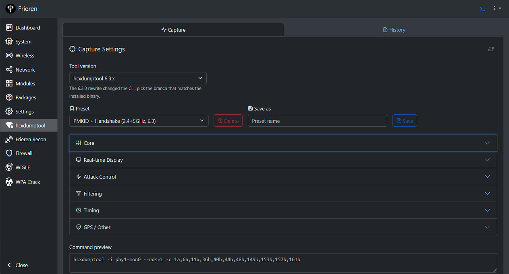

# Frieren: The micro-framework for security gadgets



## Description

Frieren is a framework for running security tools on OpenWrt routers and Single Board Computers (SBCs). It provides a web panel with WiFi management, installable modules, an integrated terminal, and a package manager. The stack is a PHP backend API with a React frontend, designed to be lightweight enough for embedded devices while remaining extensible through third-party modules.

## Features

- **WiFi Management** — Create, edit, and remove wireless interfaces. Scan for networks, configure radios, edit raw UCI config.
- **Network** — Manage network interfaces, view DHCP leases, and run connectivity diagnostics.
- **Module System** — Install, remove, and pin third-party modules from a remote repository. Modules load dynamically as UMD bundles.
- **Package Manager** — Install and remove opkg packages directly from the web panel.
- **Integrated Terminal** — Web-based terminal (ttyd) accessible from the panel.
- **System Tools** — Dashboard with system stats, USB device listing, filesystem usage, syslog viewer, diagnostics, and init.d service control.
- **Settings** — Configure hostname, timezone, user password, and panel theme.
- **Extensible** — Scaffold new modules with `frieren-module-template`. PHP controller + React frontend per module.

## Components

- **[frieren-back](frieren-back/)** — PHP micro-framework. JSON POST API with session auth, CSRF, UCI config integration, and a mini ORM.
- **[frieren-front](frieren-front/)** — React SPA (Vite, Wouter, Jotai, React Query). Supports dynamic UMD module loading.
- **[frieren-module-template](frieren-module-template/)** — Scaffolding tool for developing third-party modules with shared dependencies via window globals.
- **[frieren-terminal](frieren-terminal/)** — `@frieren/terminal-core`, a TypeScript/xterm.js library bundled into the frontend. Provides the live ttyd terminal client, a read-only log viewer, and the shared terminal themes.
- **[tools](tools/)** — Development helpers: dev API proxy, device deploy script, API test client, and a PHP minifier.

## Related Repositories

- **[Frieren Modules](https://github.com/xchwarze/frieren-modules)**: Contains community-developed modules based on the `frieren-module-template`. This repository is a resource for users looking to extend the functionality of their Frieren installation with additional features.
- **[Frieren Release](https://github.com/xchwarze/frieren-release)**: Hosts the installers for deploying precompiled versions of Frieren. This repository is ideal for users who wish to install Frieren quickly and easily without going through the build process.
- **[Frieren Modules Release](https://github.com/xchwarze/frieren-modules-release)**: Build pipeline for the module catalog — generates the `modules.json` index and the per-module release tarballs that the panel installs from.

## Installation

Frieren runs on OpenWrt (official builds, not forks). It can be installed via an automated script or compiled manually.

### Quick Installation

For a quick and easy installation, execute the following command in your terminal. This script will handle all necessary configurations and setup steps:

```bash
wget -qO- https://raw.githubusercontent.com/xchwarze/frieren-release/master/install/install-openwrt.sh | sh
```

> **New to this? Start here.** If you're not sure what OpenWrt is, how to flash it, or
> how to open the panel afterwards, follow the step-by-step, beginner-friendly
> **[Installation FAQ](FAQ.md)** — it walks you through everything from a clean device to
> logging in.

### Manual Compilation

Each component within the Frieren project (`frieren-back`, `frieren-front` and `frieren-module-template`) has its own detailed `README.md` file with specific build and installation instructions. Please refer to these files in their respective directories for more detailed guidance.

### Module Development

Use `frieren-module-template` to scaffold new modules. Run `yarn wizard` to set up a new module, develop your feature, then `yarn build` to compile a UMD bundle. See the [module template README](frieren-module-template/README.md) for details.

## License

This project is licensed under the PolyForm Noncommercial License 1.0.0.

Non-commercial use is permitted. Commercial use is not permitted under this license.
Commercial use requires a separate commercial license from the author.

For commercial licensing, contact: xchwarze@gmail.com

## Contributing

Contributions welcome — new features, bug fixes, or modules. See each component's README for build instructions.

## Authors

- **Lead Developer**: DSR! - xchwarze@gmail.com

## Support the Development

If you find Frieren useful, consider supporting development. Donations fund testing hardware and ongoing work. Send via Binance or join [Patreon](https://www.patreon.com/xchwarze) for exclusive updates and builds.

[](https://www.patreon.com/xchwarze)

